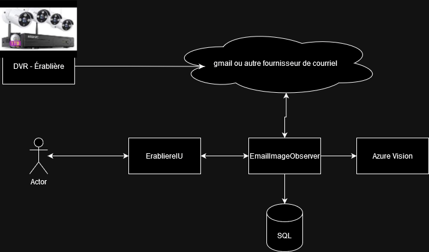

# EmailImagesObserver

## Goal

Improve capabilities of an ip camera system.

Compatible email services

- office 365
- gmail

## How it work

This app connect to an imap server and listen to new message sent. When there is one and the message have an attachment, if it is an image, the images is sent to an AI service and result are store in an EF repository of choices. Alerte may be sent to to a user via twilio.



## Pre-requisit

1. Email address
2. Email password
3. Imap server address
4. Imap server port

### Optional

1. Azure cognitive service url
2. Azure cognitive service subscription key
3. Twilio account sid
4. If no Azure subscription key, you can use the Florence2 AI service. To enable it, you need to set the environment variable `USE_FLORENCE2_VISION` to true. The model will be downloaded from the internet and will be used to process the images. About 1.06 GB of data will be downloaded.
5. Set the start date of the email to process. The default value may change upon release of the app. You can set the environment variable `StartDate` to a specific date. The format is UTC.

## Run the app

```
dotnet watch run
```

Local url are:
 - http://localhost:5100
 - https://localhost:5101

## Deploy the app

There is a docker image availlable on dockerhub. Here is an example of deployment behind reverse proxy that use many configuration.

https://github.com/freddycoder/AzureAKS-TLS/blob/main/emailimagesobserver/emailimagesobserver-deployment.yaml

## Configuration example

For a list of configuration exemple see the [Configuration.md](Configuration.md) file.

### API

The app can expose an API but as of now, it does not support authentication. To enable the API, you need to set the environment variable `EnableUnsecureController` to true.

The API is enable also if the ASPNETCORE_ENVIRONMENT is set to Development.

## Additionnal documentation

Mailkit: 
 - http://www.mimekit.net/docs/html/R_Project_Documentation.htm
 - https://github.com/jstedfast/MailKit

Azure computer vision
 - https://docs.microsoft.com/en-us/azure/cognitive-services/computer-vision/quickstarts-sdk/client-library?tabs=visual-studio&pivots=programming-language-csharp

Florence2 AI model
 - https://www.microsoft.com/en-us/research/publication/florence-2-advancing-a-unified-representation-for-a-variety-of-vision-tasks/